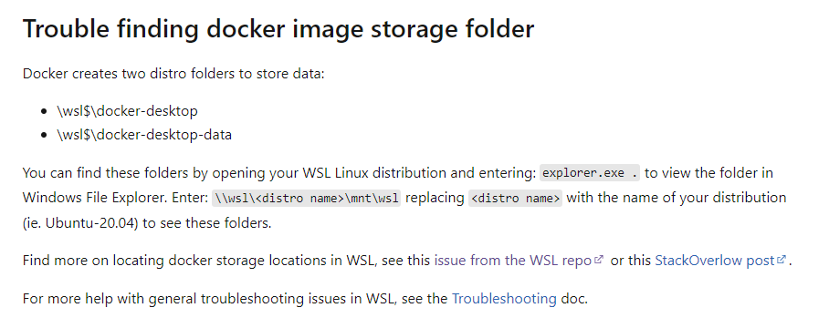
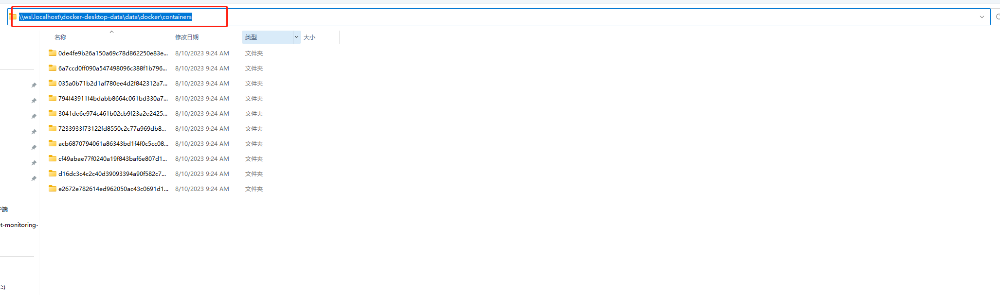

### 背景：
使用ELK收集Docker容器的日志數據，在filebeat配置中指定Container的日志路徑后，在Kibana看板卻看不到任何日志消息

### 排查過程：

1. 使用docker logs命令查看容器日志，發現日志正常輸出:
    ```
    ubuntu@DESKTOP-HH3PJAQ:~$ docker logs -f app
    INFO:Connecting to database...
    INFO:Connected to database!
    INFO:topicmanager initialized
    INFO:Connecting to redis...
    INFO:Connected to redis!
    INFO:


    ________       _____             ______   ________      ______       _____ 
    ___  __ \_____ __  /________________  /   ___  __ \________  /_________  /_
    __  /_/ /  __ `/  __/_  ___/  __ \_  /    __  /_/ /  __ \_  __ \  __ \  __/
    _  ____// /_/ // /_ _  /   / /_/ /  /     _  _, _// /_/ /  /_/ / /_/ / /_  
    /_/     \__,_/ \__/ /_/    \____//_/      /_/ |_| \____//_.___/\____/\__/  
                                                                            
    ________              _____                 
    __  ___/____  __________  /____________ ___ 
    _____ \__  / / /_  ___/  __/  _ \_  __ `__ \
    ____/ /_  /_/ /_(__  )/ /_ /  __/  / / / / /
    /____/ _\__, / /____/ \__/ \___//_/ /_/ /_/ 
        /____/                               

    INFO:Server Start...
    INFO:Initializing ROS node...
    INFO:ROS node initialized.
    DEBUG:Creating node: zj_robot_subscriber
    DEBUG:xmlrpc_port: 45159
    DEBUG:tcpros_port: 45160
    DEBUG:Using selector: EpollSelector
    INFO:     Started server process [1]
    INFO:     Waiting for application startup.
    INFO:     Application startup complete.
    INFO:     Uvicorn running on http://0.0.0.0:8000 (Press CTRL+C to quit)
    DEBUG:tm._add: /zj_robot/robot_real_time_info, common/robot_real_time_info, sub
    DEBUG:master.registerSubscriber(/zj_robot_subscriber, /zj_robot/robot_real_time_info, common/robot_real_time_info, http://192.168.2.43:45159/)
    DEBUG:tm._add: /zj_robot/sensor_data, common/sensor_data, sub
    DEBUG:master.registerSubscriber(/zj_robot_subscriber, /zj_robot/sensor_data, common/sensor_data, http://192.168.2.43:45159/)
    DEBUG:master.registerService(/zj_robot_subscriber, /zj_robot/patrol_picture, rosrpc://192.168.2.43:45160, http://192.168.2.43:45159/)
    DEBUG:requestTopic('/rosout', '/rosout', [['TCPROS']])
    DEBUG:requestTopic[/rosout]: choosing protocol TCPROS
    DEBUG:requestTopic('/rosout', '/rosout', [['TCPROS']]) returns (1, 'ready on 192.168.2.43:45160', ['TCPROS', '192.168.2.43', 45160])
    DEBUG:[/rosout]: writing header
    INFO:topic[/rosout] adding connection to [/rosout], count 0
    ```

2. 使用docker inspect命令查看容器的日志存儲路徑:

    ```    
    ubuntu@DESKTOP-HH3PJAQ:~$ docker inspect --format='{{.LogPath}}' app
    /var/lib/docker/containers/e2672e782614ed962050ac43c0691d1abe4bd753911b7429127b78216cc8e252/e2672e782614ed962050ac43c0691d1abe4bd753911b7429127b78216cc8e252-json.log

    ubuntu@DESKTOP-HH3PJAQ:~$ cat /var/lib/docker/containers/e2672e782614ed962050ac43c0691d1abe4bd753911b7429127b78216cc8e252/e2672e782614ed962050ac43c0691d1abe4bd753911b7429127b78216cc8e252-json.log
    cat: /var/lib/docker/containers/e2672e782614ed962050ac43c0691d1abe4bd753911b7429127b78216cc8e252/e2672e782614ed962050ac43c0691d1abe4bd753911b7429127b78216cc8e252-json.log: No such file or directory
    ```

   明明存在日志的文件路徑，但是卻現日志文件是空的

3. 搜索微軟官方關於WSL2文檔：
   
   原因如下：

   

    於是就去文件管理器中查看WSL2的文件路徑，發現原來Docker的日志文件路徑是在Windows的文件系統中，而不是在WSL2的文件系統中

    

4. 在WSL2下嘗試訪問此路徑

    ```
    ubuntu@DESKTOP-HH3PJAQ:~$ cd \\wsl.localhost\docker-desktop-data\data\docker\containers
    bash: cd: \wsl.localhostdocker-desktop-datadatadockercontainers: No such file or directory
    ```
    無法訪問，後來的經過瞭解，需要先挂載此路徑，才能訪問


   


### 如何解決
步驟1:
打開Windows的Powershell，輸入以下命令：
```net use h:\\wsl$\docker-desktop-data```
其中，请将 h: 替换为您的计算机上不存在的驱动器号。

步驟2:
打開WSL2的終端，輸入以下命令：

```
sudo mkdir /mnt/docker
sudo mount -t drvfs h: /mnt/docker
```

步驟3:

進入挂載好的路徑下查看docker的data是否存在
```
ubuntu@DESKTOP-HH3PJAQ:/$ cd mnt/docker/data/docker/containers/
ubuntu@DESKTOP-HH3PJAQ:/mnt/docker/data/docker/containers$ ls
035a0b71b2d1af780ee4d2f842312a7bdd567c92e9d869e34c07247a25264738  7233933f73122fd8550c2c77a969db8510cd36f16b86c8b5daf30b80526841a6  d16dc3c4c2c40d39093394a90f582c721189f78e436c2bde5a2bd026b64cb2d9
0de4fe9b26a150a69c78d862250e83e329cc8468b83091bc6cd7c4fb7b709934  794f43911f4bdabb8664c061bd330a7fc16901d859e2254cc88f0364278dc93a  e2672e782614ed962050ac43c0691d1abe4bd753911b7429127b78216cc8e252
3041de6e974c461b02cb9f23a2e242543f895a4b6a0156b81a365df74fd09012  acb6870794061a86343bd1f4f0c5cc08007ed1f94f6adad685cbfbfb102d8947
6a7ccd0ff090a547498096c388f1b796340a2cd3b32b2fc3feb6af79d329bbee  cf49abae77f0240a19f843baf6e807d16a8ba3fd3aa404c679274cb95c02cafb
```

至此問題已經解決，只需在docker-compose的filebeat配置文件中做好日志的映射即可。
遺留問題：使用inspect命令得到的路徑到底從何而來呢？

### 參考文檔


